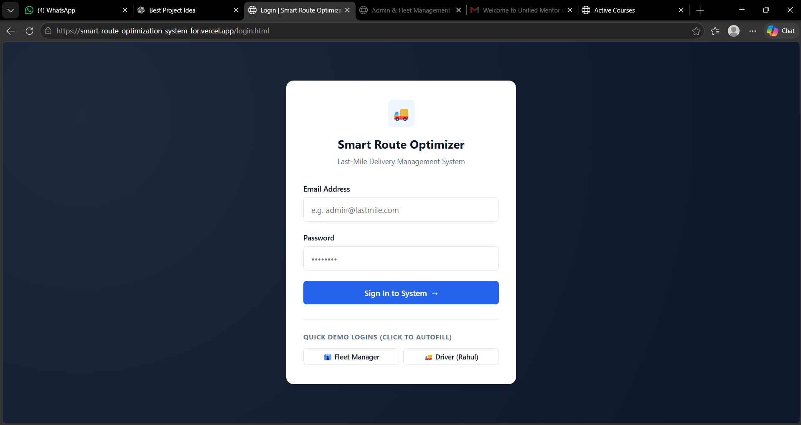
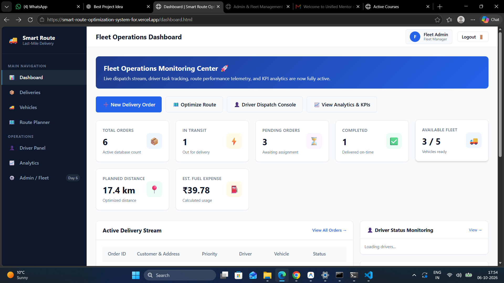
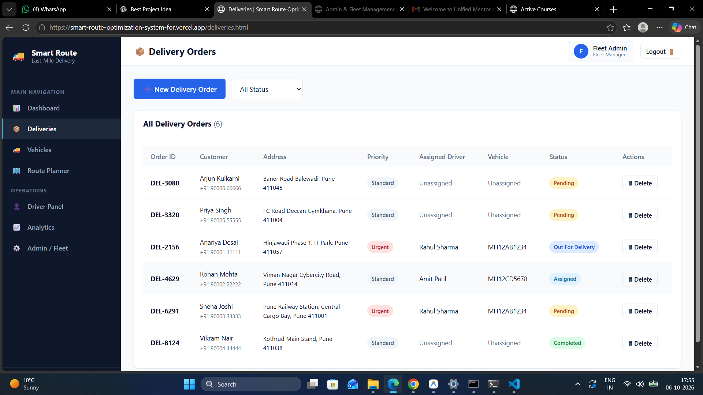
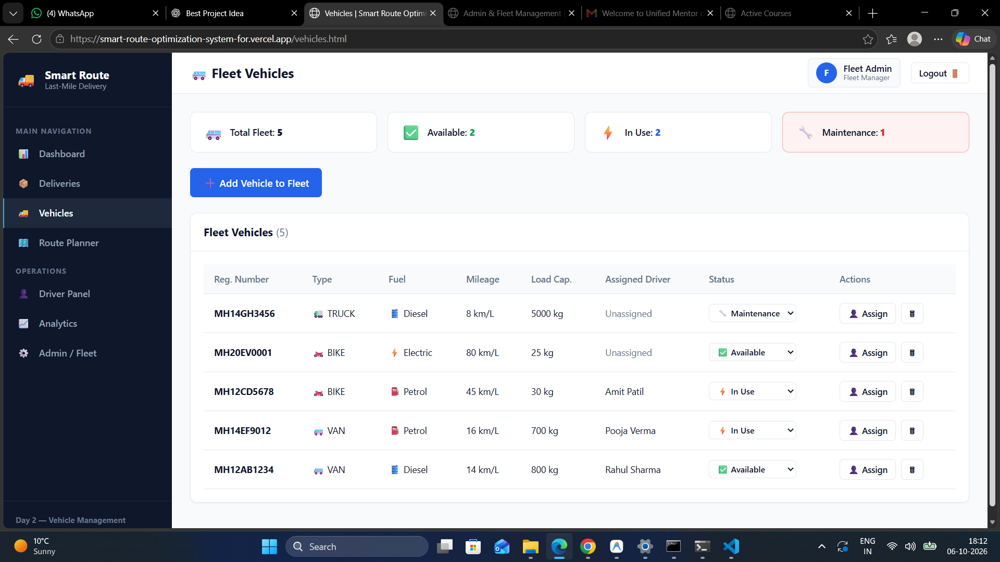
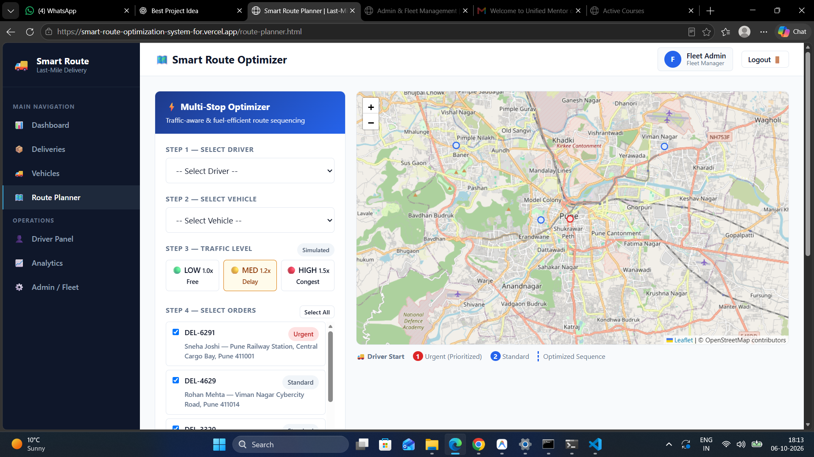
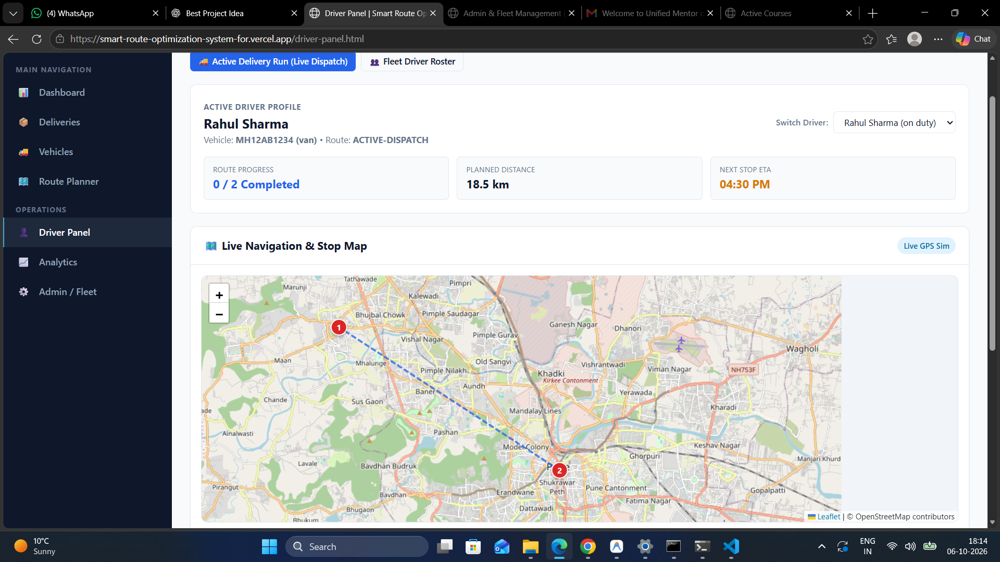
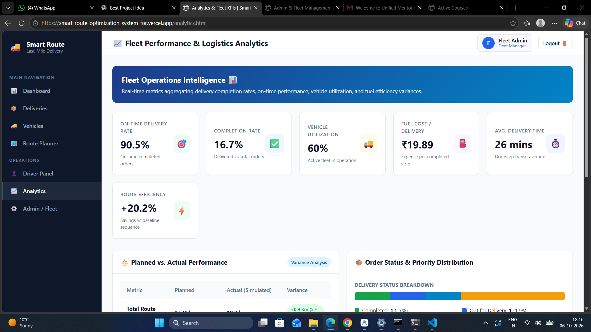
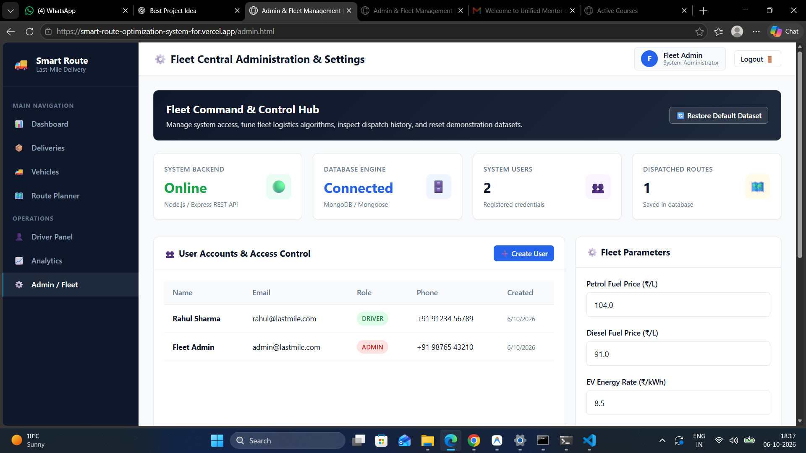

# 🚚 Smart Route Optimization System for Last-Mile Delivery

A complete full-stack **Last-Mile Delivery and Route Optimization System** designed to help fleet managers efficiently manage deliveries, drivers, vehicles, routes, traffic conditions, fuel costs, and logistics performance.

The system provides **role-based access for Fleet Managers/Admins and Delivery Drivers**, along with route optimization, interactive maps, delivery tracking, analytics, and fleet management.

---

### 🚀 Live Demo

👉 **[Open Smart Route Optimization System](https://smart-route-optimization-system-for.vercel.app/login.html)**

> Please log in using the demo credentials below to access the application.

---

## 🔐 Demo Credentials

### 👨‍💼 Admin / Fleet Manager

```text
Admin:
Email: admin@lastmile.com
Password: admin123

Driver:
Email: rahul@lastmile.com
Password: driver123

### 📚 Web Documentation

👉 **[View Project Documentation](https://smart-route-optimization-system-for.vercel.app/docs.html)**

### 📄 Product Requirements Document

[View PRD](./docs/PRD.md)

---

# 📌 Problem Statement

Last-mile delivery is one of the most challenging and expensive parts of logistics operations.

Delivery companies often face problems such as:

- Inefficient manual route planning
- Excessive travel distance
- Traffic-related delivery delays
- High fuel consumption
- Poor vehicle utilization
- Difficult driver coordination
- Lack of real-time delivery monitoring
- Limited logistics performance analytics

The **Smart Route Optimization System** addresses these problems by providing a centralized platform for route planning, fleet management, driver management, delivery tracking, and logistics analytics.

---

# 🎯 Objectives

The main objectives of this project are:

- Optimize multi-stop delivery routes.
- Reduce unnecessary travel distance.
- Improve delivery efficiency.
- Prioritize urgent deliveries.
- Consider traffic conditions during route planning.
- Estimate fuel consumption and fuel costs.
- Assign drivers and vehicles efficiently.
- Track delivery status.
- Monitor active delivery operations.
- Provide useful logistics analytics.
- Improve fleet and driver productivity.

---

# ✨ Key Features

### 🔐 1. Role-Based Authentication

- Admin/Fleet Manager login
- Driver login
- JWT-based authentication
- Password hashing using bcrypt
- Protected API routes

### 📦 2. Delivery Management

- Create deliveries
- Update deliveries
- Delete deliveries
- Set delivery priority
- Set delivery weight
- Set delivery time windows
- Track delivery status
- Report delivery issues

### 🚚 3. Fleet Vehicle Management

Manage company fleet vehicles including:

- Vehicle number
- Vehicle type
- Vehicle capacity
- Fuel type
- Mileage
- Assigned driver
- Vehicle availability/status

Supported vehicle examples:

- 🚗 Cars
- 🏍️ Bikes
- 🚐 Vans
- 🚚 Trucks

### 👨‍✈️ 4. Driver Management

Fleet managers can:

- Add drivers
- View driver details
- Assign vehicles
- Track driver availability
- View assigned routes
- Monitor delivery progress

### 🗺️ 5. Route Optimization

The system provides:

- Multi-stop route planning
- Haversine distance calculation
- Priority-aware route optimization
- Nearest Neighbor algorithm
- Route scoring
- Optimized delivery sequence
- Interactive map visualization

### 🚦 6. Traffic-Aware Routing

The system simulates different traffic levels:

| Traffic | Factor |
|---|---:|
| 🟢 Low | 1.0x |
| 🟡 Medium | 1.2x |
| 🔴 High | 1.5x |

Traffic conditions affect:

- Estimated travel time
- ETA
- Route score
- Delivery planning

### ⛽ 7. Fuel Estimation

The system calculates:

- Estimated fuel consumption
- Fuel cost
- Cost per delivery

Based on:

- Route distance
- Vehicle mileage
- Fuel type
- Fuel price

### 📍 8. Driver Panel

Drivers can:

- View assigned deliveries
- View optimized route
- View delivery sequence
- Update delivery status
- Contact customers
- Report delivery issues
- Track assigned route

### 📊 9. Analytics Dashboard

The analytics module provides:

- On-Time Delivery Rate
- Completion Rate
- Vehicle Utilization
- Planned vs Actual Distance
- Route performance
- Delivery performance

### ⚙️ 10. Admin Panel

Administrators can:

- Manage users
- Manage fleet configuration
- Manage system parameters
- View routes
- Manage drivers
- Manage vehicles
- Restore sample data

---

# 🛠️ Technology Stack

| Layer | Technologies |
|---|---|
| **Frontend** | HTML5, CSS3, JavaScript |
| **Styling** | CSS3, Flexbox, CSS Grid |
| **Backend** | Node.js, Express.js |
| **Database** | MongoDB |
| **ODM** | Mongoose |
| **Authentication** | JWT, bcryptjs |
| **Maps** | Leaflet.js, OpenStreetMap |
| **API Communication** | REST API, Fetch API |
| **Deployment** | Vercel |
| **Version Control** | Git, GitHub |

### No React

This project intentionally uses:

- HTML
- CSS
- Vanilla JavaScript
- Node.js
- Express.js
- MongoDB

No React, Angular, Vue, or TypeScript is required.

---

# 🏗️ System Architecture

```text
┌─────────────────────────────────────────────────────────────┐
│                  FRONTEND                                  │
│             HTML5 + CSS3 + JavaScript                      │
│                                                             │
│ Login | Dashboard | Deliveries | Vehicles | Route Planner  │
│ Driver Panel | Analytics | Admin                           │
└─────────────────────────────┬───────────────────────────────┘
                              │
                              │ REST API + JWT
                              ▼
┌─────────────────────────────────────────────────────────────┐
│                    BACKEND                                 │
│                 Node.js + Express.js                       │
│                                                             │
│ Authentication                                              │
│ Delivery Management                                         │
│ Driver Management                                           │
│ Vehicle Management                                          │
│ Route Optimization                                          │
│ Traffic Simulation                                          │
│ Fuel Calculation                                            │
│ ETA Calculation                                             │
│ Analytics                                                   │
└─────────────────────────────┬───────────────────────────────┘
                              │
                              │ Mongoose
                              ▼
┌─────────────────────────────────────────────────────────────┐
│                    DATABASE                                │
│                    MongoDB                                 │
│                                                             │
│ Users | Deliveries | Drivers | Vehicles | Routes           │
└─────────────────────────────────────────────────────────────┘
```

---

# 📂 Project Structure

```text
SMART ROUTE OPTIMIZATION SYSTEM FOR LAST-MILE DELIVERY/
│
├── frontend/
│   │
│   ├── index.html
│   ├── login.html
│   ├── dashboard.html
│   ├── deliveries.html
│   ├── vehicles.html
│   ├── route-planner.html
│   ├── driver-panel.html
│   ├── analytics.html
│   ├── admin.html
│   ├── docs.html
│   │
│   ├── css/
│   │   └── style.css
│   │
│   └── js/
│       ├── config.js
│       ├── auth.js
│       ├── dashboard.js
│       ├── deliveries.js
│       ├── vehicles.js
│       ├── route.js
│       ├── driver.js
│       ├── analytics.js
│       └── admin.js
│
├── backend/
│   │
│   ├── server.js
│   ├── package.json
│   ├── vercel.json
│   ├── .env
│   ├── .env.example
│   │
│   ├── api/
│   │   └── index.js
│   │
│   ├── config/
│   │   └── db.js
│   │
│   ├── models/
│   │   ├── User.js
│   │   ├── Delivery.js
│   │   ├── Driver.js
│   │   ├── Vehicle.js
│   │   └── Route.js
│   │
│   ├── routes/
│   │   ├── authRoutes.js
│   │   ├── dashboardRoutes.js
│   │   ├── deliveryRoutes.js
│   │   ├── driverRoutes.js
│   │   ├── vehicleRoutes.js
│   │   ├── routeRoutes.js
│   │   └── analyticsRoutes.js
│   │
│   └── utils/
│       ├── distanceCalculator.js
│       ├── etaCalculator.js
│       ├── fuelCalculator.js
│       └── routeOptimizer.js
│
├── docs/
│   └── PRD.md
│
├── screenshots/
│   ├── 01-login.png
│   ├── 02-dashboard.png
│   ├── 03-deliveries.png
│   ├── 04-vehicles.png
│   ├── 05-route-planner.png
│   ├── 06-driver-panel.png
│   ├── 07-analytics.png
│   └── 08-admin.png
│
├── PROJECT_PROGRESS.md
├── .gitignore
└── README.md
```

---

# 📸 Application Screenshots

## 🔐 Login



---

## 📊 Dashboard



---

## 📦 Deliveries



---

## 🚚 Fleet Vehicles



---

## 🗺️ Route Planner



---

## 👨‍✈️ Driver Panel



---

## 📈 Analytics



---

## ⚙️ Admin Panel



---

# 👥 User Roles

| Feature | Admin / Fleet Manager | Driver |
|---|:---:|:---:|
| Login | ✅ | ✅ |
| Dashboard | ✅ | ✅ |
| Create Deliveries | ✅ | ❌ |
| Edit Deliveries | ✅ | ❌ |
| Delete Deliveries | ✅ | ❌ |
| Manage Vehicles | ✅ | ❌ |
| Manage Drivers | ✅ | ❌ |
| Optimize Routes | ✅ | ❌ |
| View Assigned Route | ✅ | ✅ |
| Update Delivery Status | ✅ | ✅ |
| Report Delivery Issues | ✅ | ✅ |
| View Analytics | ✅ | ❌ |
| Manage Users | ✅ | ❌ |
| System Configuration | ✅ | ❌ |

---

# 🧮 Route Optimization Algorithm

The system uses multiple calculations to generate efficient delivery routes.

## 1. Haversine Distance

The Haversine formula calculates geographical distance between two latitude/longitude points.

```text
Δφ = lat₂ - lat₁

Δλ = lon₂ - lon₁

a = sin²(Δφ/2)
    + cos(lat₁) × cos(lat₂) × sin²(Δλ/2)

c = 2 × atan2(√a, √(1-a))

Distance = 6371 × c
```

Distance is calculated in kilometers.

---

## 2. Priority-Based Route Optimization

Urgent deliveries receive higher priority during route planning.

```text
Effective Distance =
Raw Distance × Priority Factor
```

For urgent deliveries:

```text
Priority Factor = 0.6
```

For standard deliveries:

```text
Priority Factor = 1.0
```

This helps urgent deliveries receive preference during route optimization.

---

## 3. Nearest Neighbor Algorithm

The system uses a **Nearest Neighbor approach** to select the next delivery stop.

Basic process:

```text
Start from Driver Location
        ↓
Find nearest suitable delivery
        ↓
Check priority
        ↓
Add delivery to route
        ↓
Move to selected delivery
        ↓
Repeat until all deliveries are completed
```

---

# 🚦 Traffic-Aware ETA

Traffic conditions affect estimated travel time.

```text
Effective Speed =
Base Speed / Traffic Factor
```

Traffic factors:

```text
Low Traffic    → 1.0
Medium Traffic → 1.2
High Traffic   → 1.5
```

Driving time:

```text
Driving Time =
Distance / Effective Speed × 60
```

Service time is also added for delivery handovers.

```text
Total ETA =
Driving Time + Delivery Service Time
```

---

# ⛽ Fuel Calculation

Fuel consumption is calculated using:

```text
Fuel Consumed =
Total Distance / Vehicle Mileage
```

Fuel cost:

```text
Fuel Cost =
Fuel Consumed × Fuel Price
```

Cost per delivery:

```text
Cost Per Delivery =
Total Fuel Cost / Number of Deliveries
```

---

# 📊 Route Score

Routes are evaluated using multiple factors:

```text
Route Score =
(Distance × 1.5)
+ Traffic Penalty
+ Fuel Cost
- Priority Bonus
```

A lower score represents a more efficient route.

---

# 📡 REST API

| Method | Endpoint | Description |
|---|---|---|
| POST | `/api/auth/login` | Login user |
| POST | `/api/auth/register` | Register user |
| GET | `/api/auth/me` | Get current user |
| GET | `/api/auth/users` | Get users |
| POST | `/api/auth/seed-reset` | Restore sample data |
| GET | `/api/deliveries` | Get deliveries |
| POST | `/api/deliveries` | Create delivery |
| PUT | `/api/deliveries/:id/status` | Update delivery status |
| POST | `/api/deliveries/:id/issue` | Report issue |
| DELETE | `/api/deliveries/:id` | Delete delivery |
| GET | `/api/drivers` | Get drivers |
| POST | `/api/drivers` | Add driver |
| GET | `/api/vehicles` | Get vehicles |
| POST | `/api/vehicles` | Add vehicle |
| GET | `/api/routes/data` | Get route planning data |
| POST | `/api/routes/preview` | Preview optimized route |
| POST | `/api/routes/optimize` | Optimize and save route |
| POST | `/api/routes/:id/recalculate` | Recalculate route |
| GET | `/api/routes/driver/:driverId` | Get driver's route |
| GET | `/api/analytics` | Get analytics |
| GET | `/api/dashboard/summary` | Get dashboard metrics |

---

# 🚀 Installation & Setup

## Prerequisites

Install:

- Node.js 18+
- MongoDB or MongoDB Atlas
- Git
- Web Browser

---

## 1. Clone Repository

```bash
git clone https://github.com/madhurkamble/SMART-ROUTE-OPTIMIZATION-SYSTEM-FOR-LAST-MILE-DELIVERY.git
```

Go into the project:

```bash
cd "SMART ROUTE OPTIMIZATION SYSTEM FOR LAST-MILE DELIVERY"
```

---

## 2. Install Backend Dependencies

```bash
cd backend
npm install
```

---

## 3. Configure Environment Variables

Create:

```text
backend/.env
```

Example:

```env
PORT=5000
MONGODB_URI=your_mongodb_connection_string
SESSION_SECRET=your_secret
```

> Never commit your `.env` file to GitHub.

---

## 4. Start Backend

```bash
npm start
```

The backend will run on:

```text
http://localhost:5000
```

---

## 5. Open Application

For local development:

```text
http://localhost:5000/login.html
```

If the frontend is served separately:

```text
http://localhost:<frontend-port>/login.html
```

---

# 🔐 Demo Credentials

### Admin / Fleet Manager

```text
Email: admin@lastmile.com
Password: admin123
```

### Driver

```text
Email: rahul@lastmile.com
Password: driver123
```

> These credentials are intended for demonstration/testing purposes.

---

# 🌐 Deployment

The project is deployed using **Vercel**.

### Frontend

```text
https://smart-route-optimization-system-for.vercel.app
```

### Backend API

```text
https://smart-route-optimization-backend.vercel.app
```

### Database

MongoDB Atlas is used for the production database.

---

# 🔄 Production Architecture

```text
                    USER
                     │
                     ▼
        ┌─────────────────────────┐
        │   Vercel Frontend       │
        │ HTML + CSS + JavaScript │
        └────────────┬────────────┘
                     │
                     │ REST API
                     ▼
        ┌─────────────────────────┐
        │   Vercel Backend        │
        │   Node.js + Express     │
        └────────────┬────────────┘
                     │
                     │ Mongoose
                     ▼
        ┌─────────────────────────┐
        │      MongoDB Atlas      │
        └─────────────────────────┘
```

Map services:

```text
Browser
   │
   ▼
Leaflet.js
   │
   ▼
OpenStreetMap
```

---

# 🔒 Security

The project includes:

- JWT authentication
- Password hashing using bcrypt
- Protected API routes
- Environment variables
- CORS configuration
- Role-based access control
- MongoDB Atlas authentication

Sensitive information such as database credentials and secrets should always remain inside `.env`.

---

# 🧪 Testing

The application was tested across the major modules:

- Login authentication
- Dashboard loading
- Delivery CRUD operations
- Vehicle management
- Driver management
- Route optimization
- Map rendering
- Traffic simulation
- Fuel calculation
- ETA calculation
- Delivery status updates
- Analytics
- Admin management

---

# 📈 Future Enhancements

Possible future improvements include:

- Real-time GPS tracking
- Google Maps or Mapbox integration
- Real traffic API integration
- Advanced Vehicle Routing Problem algorithms
- Automatic multi-vehicle route allocation
- Driver mobile application
- Push notifications
- Customer delivery tracking
- Delivery proof with photo/signature
- Advanced predictive analytics
- Cloud-based real-time fleet monitoring

---

# 🎓 Academic Project Details

**Project Title:**  
Smart Route Optimization System for Last-Mile Delivery

**Domain:**  
Logistics & Supply Chain / Web Application Development

**Project Type:**  
Full-Stack Web Application

**Development Approach:**  
Structured 6-Day Development Plan

**Primary Technologies:**  
HTML5, CSS3, JavaScript, Node.js, Express.js, MongoDB

---

# 👨‍💻 Author

## Madhur Kamble

**Bachelor of Engineering – Computer Engineering**  
**Zeal College of Engineering and Research, Pune**

I developed this project as an academic and practical full-stack application focused on solving real-world challenges in **last-mile delivery, fleet management, route optimization, and logistics analytics**.

### 🔗 Connect With Me

- 💻 **GitHub:** [github.com/madhurkamble](https://github.com/madhurkamble)
- 🔗 **LinkedIn:** [linkedin.com/in/madhur-kamble-55911b290](https://www.linkedin.com/in/madhur-kamble-55911b290)

---

# ⭐ Project

If you find this project useful or interesting, feel free to explore the repository and connect with me on GitHub or LinkedIn.

**Built with Node.js, Express.js, MongoDB, HTML, CSS, JavaScript, Leaflet and OpenStreetMap.**
